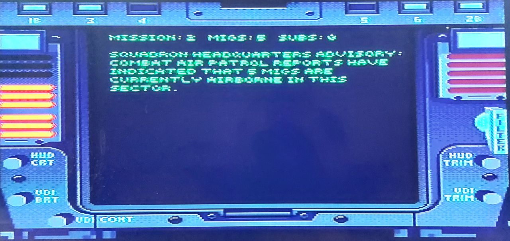
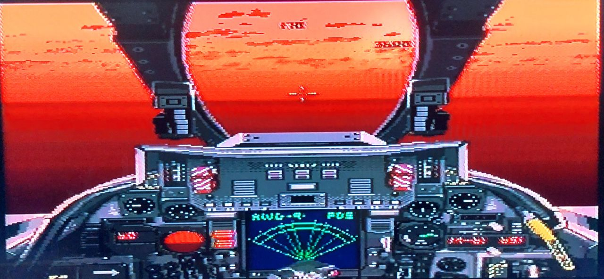
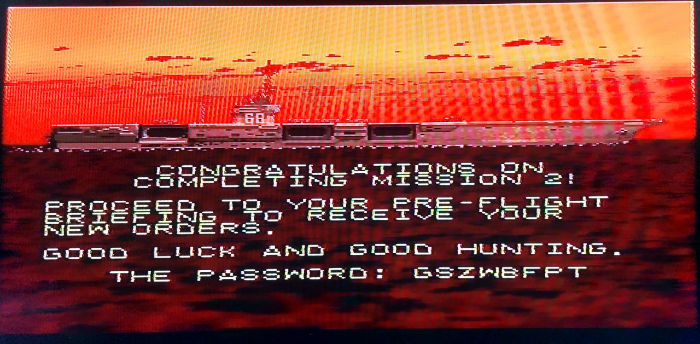

In Misison 2, the Challenge is to fight 2 enemy planes at the same time. The dogfight takes place in a beatiful redly lit setting. 

MIGS: 5 SUBS: 0

To quickly deal with them, use your map to point yourself at them, use all your missiles one after each other (keep yourself looking at them, wait for red indicator light, fire).
The last enemy, use your MG by coming up behind him after a direct confrontation.

Good Hunting!

Code: GSZWBFPT

